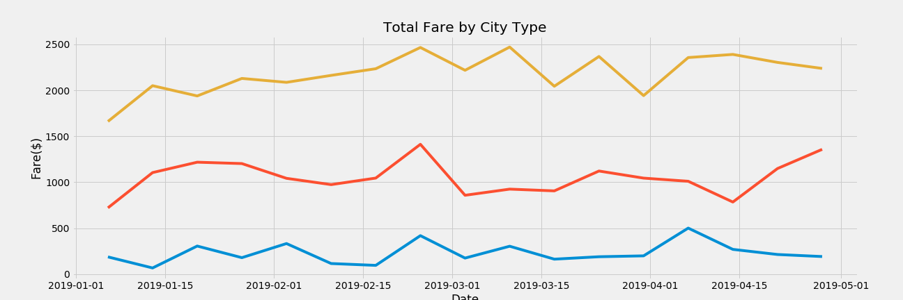
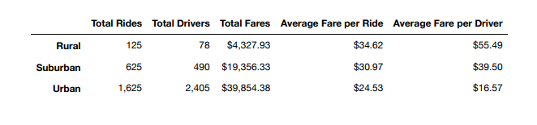

# PyBer_Analysis

Paragraph 1

- The overarching purpose of this assignment was to dig into the driver, ride, and city data to uncover trends that are specific to, for example, how the average fare per driver in city types compare with each other.  Mixing and matching various data points and comparing to other data points while changing the conditions allowed us to identify interesting trends, such as how rural city types have fewer driver AND rides, BUT more profitable average fares. 
- Many individual tasks were taken to produce the deliverables, but the most notable ones that I can think of are 1) merging ride and city data to produce a more comprehensive data set for more advanced/custom calculations and 2) creating smaller, individual average fare/total rides plots and then combining them into a one plot that show many different trends. I also identified some interested trends around standard deviation, as well as outlier fare prices in certain cities.
- The final summary and multi-line graph show us a few things.  One, most of the fare amounts for each week follow approximately the same up and down trends with some exceptions.  The Urban areas have many more drivers and ride and make the company more money overall, but my guess is that the rural areas are more profitable since there are fewer driver/rides but higher fares.

- Short summary of results: Suburban fare amounts by week start to spike in the middle of April, which may be a seasonal effect like warmer weather making people want to hail rides more often.   Urban areas dominate when it comes to having the most rides and ESPECIALLY the most drivers.  It seems that there may be more drivers than necessary for the urban areas which drives the average fare down, vs the rural areas which have fewer drivers but higher fares.  

Paragraph 2

- 

Paragraph 3

- In the beginning of this module, one of goals laid out for me was to identify opportunities for ways to improve access to ride-sharing services and determine affordability for underserved neighborhoods.  People in more dense cities generally have more options across the board, so finding ways to incentivize drivers to go to rural areas would help serve those communities better.
